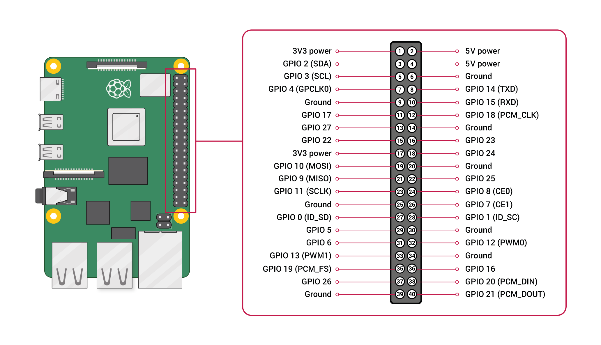

# Linux helper MD

## Table of Contents

- [SD & OS](#sd--os)
  - [Clearing and Using the SD](#clearing-and-using-the-sd)
  - [Flashing an SD with an OS](#flashing-an-sd-with-an-os)
- [Screening the Pi](#screening-the-pi)
- [UART TTL Cable Wiring](#uart-ttl-cable-wiring)
  - [GPIO Diagram](#gpio-diagram)
- [Terminal Command References](#terminal-command-references)

## SD & OS

### Clearing and Using the SD

1. Insert the SD card to the computer and run a terminal session.
2. If the SD card doesn't automatically mount follow the next steps:
   - 2a. In the terminal run [`lsblk`](#lsblk-ref), and identify your SD in the list.
   - 2b. Create a directory to mount the SD on using [`sudo mkdir -p /mnt/sdcard`](#mkdir-ref).
   - 2c. Mount the SD card to the directory using [`sudo mount /dev/PARTITION_NAME /mnt/sdcard`](#mount-ref). (Replace 'PARTITION_NAME' with the SD's actual partition name).
3. To wipe the SD card, first unmount the SD card using [`sudo umount /mnt/sdcard`](#unmount-ref), and follow the next steps:

   - 3a. Wipe the SD card using [`sudo dd if=/dev/zero of=/dev/PARTITION_NAME bs=4M status=progress`](#wipe-ref). (Replace 'PARTITION_NAME' with the SD's actual partition name from).
     > ⚠️ **_WARNING:_** This is a thorough wipe and might take a while.
   - 3b. Create a new partition table using [`sudo fdisk /dev/PARTITION_NAME`](#fdisk-ref)

### Flashing an SD with an OS

1. Open a terminal session and install a raspberry imager using [`sudo pacman -S rpi-imager`](#rpiimager-ref)
2. Run the imager using [`rpi-imager`](#runimager-ref)
3. Now that the RPI-Imager GUI launched, follow this flow:
   - 3a. Click "Choose OS" and select "Raspberry PI OS(Other) ➜ Raspberry Pi OS Lite (64-bit)"
   - 3b. Click "Choose Storage" and select your SD card.
4. After choosing the OS and storage, click next once and you will be met with a pop-up with multiple options. Follow the next steps:
   - 4a. Choose "Edit Settings"
   - 4b. Under the "General" tab, set up the Pi's Username & Password, and configure a wireless network for SSH Fallback, if UART fails.
   - 4c. Under the "Services" tab, check the "Enable SSH" option, and make sure "Use password authentication is selected.
   - 4d. Under the "Options" option, make sure that "Eject media when finished" and "Enable telemetry" are enabled.
   - 4e. Click save and then pick yes to flash the SD with the OS.
5. After flashing the SD with the OS, UART needs to be enabled. Follow the next steps:

   - 5a. Mount the SD using [`mount | grep sda1`](#mount-for-flash-ref), and then run [`sudo mkdir -p /mnt/pi-boot`](#mount-for-flash-ref), [`sudo mount /dev/sda1 /mnt/pi-boot`](#mount-for-flash-ref).
   - 5b. Once mounted, use [`sudo nano /mnt/pi-boot/config.txt`](#) to edit the config, and add the following lines:

     ```
      enable_uart=1
      dtparam=audio=off
     ```

6. Now you can safely unmount using [`sudo unmount /mnt/pi-boot`](#unmount-end-ref) and [`sudo unmount /mnt/pi-root`](#unmount-end-ref) and insert the SD into the Pi.

## Screening the Pi

After inserting the SD and booting the pi, follow the next steps:

1. Install a serial software using [`sudo pacman -S screen`](#serial-software-install-ref)

2) Boot up the Pi, and connect the UART to both the Pi and the computer.
3) Run [`screen /dev/ttyUSB0 115200`](#screen-the-pi-ref).
4) You will be met with a blank terminal and a cursor, hit enter a couple times and wait.
5) A login prompt will show up, use the login credentials.

This will connect you to the Pi using the UART TTL cable, and screening. You can now control the Pi with your computer.

## UART TTL Cable Wiring

To wire the UART TTL cable to the Pi correctly, use the following schema:

- Black wire - pin 6 (Ground)
- Green wire - pin 8 (GPIO 14/TX - Transmits Data)
- White wire - pin 10 (GPIO 15/RX - Receives Data)
- Red Wire - **_DO NOT CONNECT_** (VCC/POWER)

### GPIO Diagram



_Click the image to view it in full size_

## Terminal Command References

<a name="lsblk-ref"></a>

```bash
lsblk
# Lists all block devices in a tree format
# Helps identify your SD card device name (e.g., sdb, sdc)
```

<a name="mkdir-ref"></a>

```bash
sudo mkdir -p /mnt/sdcard
# Creates a mount point directory for the SD card
# -p flag creates parent directories if they don't exist
```

<a name="mount-ref"></a>

```bash
sudo mount /dev/PARTITION_NAME /mnt/sdcard
# Mounts the SD card partition to the specified directory
# Replace PARTITION_NAME with actual partition (e.g., sdb1)
```

<a name="unmount-ref"></a>

```bash
sudo umount /mnt/sdcard
# Unmounts the SD card from the mount point
```

<a name="wipe-ref"></a>

```bash
sudo dd if=/dev/zero of=/dev/PARTITION_NAME bs=4M status=progress
# WARNING: This will completely wipe the SD card!
# Replace PARTITION_NAME with actual device (e.g., sdb)
```

<a name="fdisk-ref"></a>

```bash
sudo fdisk /dev/PARTITION_NAME
# Opens fdisk utility to manage partitions
# Replace PARTITION_NAME with actual device (e.g., sdb)
```

<a name="rpiimager-ref"></a>

```bash
sudo pacman -S rpi-imager
# Installs rpi-imager using pacman
```

<a name="runimager-ref"></a>

```bash
rpi-imager
# Launches rpi-imager
```

<a name="mount-for-flash-ref"></a>

```bash
mount | grep sda1
# Checks if the SD card partition is mounted
# Shows mount point information for sda1 partition
```

<a name="unmount-end-ref"></a>

```bash
sudo umount /mnt/pi-boot
sudo umount /mnt/pi-root
# Unmounts the flashed SD card partitions
# Safely ejects both boot and root partitions before removing SD
```

<a name="serial-software-install-ref"></a>

```bash
sudo pacman -S screen
# Installs GNU Screen terminal multiplexer
# Used for serial communication with the Raspberry Pi via UART
```

<a name="screen-the-pi-ref"></a>

```bash
screen /dev/ttyUSB0 115200
# Connects to Raspberry Pi via UART serial connection
# /dev/ttyUSB0 is the USB-to-serial adapter device
# 115200 is the baud rate for communication
# Press Ctrl+A then K to exit screen session
```
